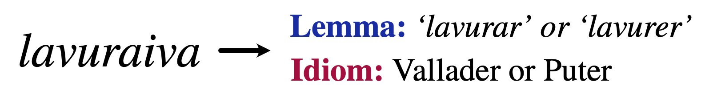

# Basic Lemmatizer for Romansh Varieties <span style="color:gray">(Beta)</span>
This Python package presents a basic dictionary-based lemmatizer for the Romansh language.
Provided a Romansh text, the lemmatizer splits it into words and looks up each word in the [Pledari Grond](https://pledarigrond.ch/) dictionaries for the five standard Romansh idioms: Sursilvan, Sutsilvan, Surmiran, Puter, and Vallader, as well as the dictionary for Rumantsch Grischun.

For example, if a Romansh text contains the word _lavuraiva_, the lemmatizer traces the word back to the Vallader and Puter dictionaries:



Typical use cases for the lemmatizer include:
- Accessing potential German translations (glosses) of Romansh words
- Automatically detecting the variety of a Romansh text, based on how many words are found in the respective dictionaries

A limitation of the current version is that the lemmatizer does not disambiguate between multiple possible ways of lemmatizing a word. Specifically:
1. If a word has multiple dictionary entries, all the dictionary entries are returned, irrespective of the context in which the word occurs.
2. If there are multiple ways of morphologically analysing a given word form, all possible analyses are returned.

## Acknowledgements and Data Rights
This package incorporates dictionary data from the [Pledari Grond](https://pledarigrond.ch/) project.

- The dictionaries for Rumantsch Grischun, Surmiran, Sursilvan and Sutsilvan are openly licensed. © **Lia Rumantscha** 1980 – 2025
- The dictionaries for Vallader and Puter are kindly provided by [**Uniun dals Grischs**](https://www.udg.ch/dicziunari) and may only be used in the context of this lemmatizer. © Uniun dals Grischs. All rights reserved.


## Usage
### Installation
`pip install git+https://github.com/ZurichNLP/romansh_lemmatizer.git@v0.0.4`

Demo:
[`https://huggingface.co/spaces/ZurichNLP/romansh-lemmatizer`](https://huggingface.co/spaces/ZurichNLP/romansh-lemmatizer)

### Examples
A couple of example use cases, namely:
- Analysis of words in a corpus
- Idiom classification
- Romansh vs. non-Romansh identification
are provided under "example_notebooks".

#### Initialising the lemmatizer
```python
from romansh_lemmatizer import Lemmatizer

lemmatizer = Lemmatizer()
sent = "La vuolp d'eira darcheu üna jada fomantada."
doc = lemmatizer(sent)
```

#### Automatic idiom detection
This will automatically detect the idiom as the one with the highest covereage score, and return each idiom with its corresponding score.
```python
print("Automatic Idiom Detection:")
print(f"The sentence '{sent}' is in:", doc.idiom) 
# <Idiom.VALLADER: 'rm-vallader'>

print("\Scores across idioms:")
for k, v in doc.idiom_scores.items():
    print("\t", k, v) 
    # {<Idiom.RUMGR: 'rm-rumgr'>: 0.77..8, <Idiom.SURSILV: 'rm-sursilv'>: 0.22...,...}
```

#### Idiom detection given a lang-specifically initialised lemmatizer
Here, since the idiom is given, that is the one that will be "detected", and will always be assigned a score of 1, while all others get a score of 0.
```python
idiom = "rm-vallader"
vallader_lemmatizer = Lemmatizer(idiom=idiom)
doc = vallader_lemmatizer(sent)

print(f"\nPassing '{idiom}' as an argument:")
print(f"The sentence '{sent}' is in: ", doc.idiom) 
# <Idiom.VALLADER: 'rm-vallader'>

print("\Scores across idioms:")
for k, v in doc.idiom_scores.items():
    print("\t", k, v) 
    # {<Idiom.RUMGR: 'rm-rumgr'>: 0.0, <Idiom.SURSILV: 'rm-sursilv'>: 0.0,...}
```

#### Accessing the tokens and their attributes
The tokens can be accessed as follows:
```python
print("\n", doc.tokens) 
# ['La', 'vuolp', "d'", 'eira', 'darcheu', 'üna', 'jada', 'fomantada', '.']
token = doc.tokens[-2]
```

And the lemmas of tokens as is described here:
```python
print(f"\nPrint {idiom}-lemmas of token '{token}'")
print(token.lemmas) 
# {rm-vallader::fomantar: [PoS=V;VerbForm=PTCP;Tense=PST;Gender=FEM;Number=SG]}

```

".all_lemmas" gives lemmas in any idiom, not just in the detected one.
```python
print(f"\nPrint all lemmas of token '{token}'")
for t in token.all_lemmas:
    print(t)
# {
#   rm-surmiran::fomanto: [PoS=ADJ;Gender=FEM;Number=SG],
#   rm-surmiran::fomantar: [PoS=V;VerbForm=PTCP;Tense=PST;Gender=FEM;Number=SG],
#   rm-vallader::fomantar: [PoS=V;VerbForm=PTCP;Tense=PST;Gender=FEM;Number=SG]
# }
```

Lemma objects have an attribute ".translation_de":
```python
token = doc.tokens[1]
lemma = list(token.lemmas.keys())

print(f"\nThe German translation of a lemma, here '{token}' is an attribute of the Lemma object")
for l in lemma:
    print(f"{l}: {l.translation_de}")

# rm-vallader::vuolp: Filou (Gauner, Spitzbube)
# rm-vallader::vuolp: Fuchs
# rm-vallader::vuolp: Schlauberger (Filou)
```

For more detailed information on object types and their attributes, cf. example_notebooks/overview.ipynb.

## Development

### Installation
`pip install -e ".[dev]"`

### Running the tests
`python -m unittest discover -s tests`
`pytest -v`

## License
The software in this project is licensed under the MIT License. For license information regarding the dictionary data, please refer to the Acknowledgements and Data Rights section above.

